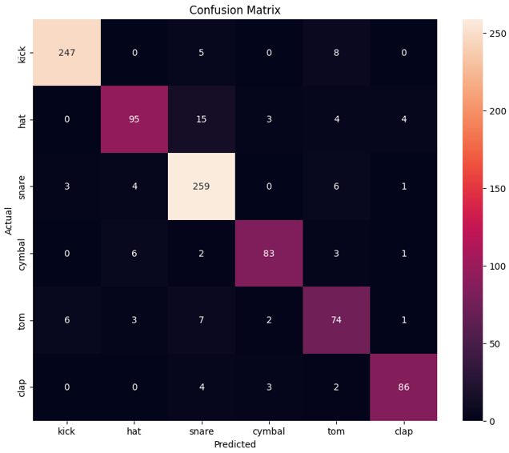

# Drum-Sound-Classifier

## Introduction
Drum sound classification is a crucial task in music production and music information retrieval. Identifying different types of drum sounds can aid in various applications, such as automated music transcription, genre classification, and music generation. This project explores the use of deep learning models, particularly CNNs, to classify drum sounds accurately.

The notebook [FinalProject_CNN_242255_242873_290432.ipynb](./FinalProject_CNN_242255_242873_290432.ipynb) and [Drum-Sound-Classifier-Presentation.pdf](./Drum-Sound-Classifier-Presentation.pdf) provide a comprehensive workflow for preprocessing audio data, training different models, and evaluating their performance.

## Dataset 

The dataset used in this project includes various types of drum sounds, each labeled with its corresponding drum type.

* **Kick:** The bass drum sound, often providing the low-end thump in a track.
* **Snare:** The sharp, cracking sound commonly used to provide rhythm.
* **Hi-hat:** The crisp, high-frequency sound, either open or closed, that adds texture to the beat.
* **Tom:** The deeper drum sounds used in fills and solos.
* **Cymbals:** The crashing or ringing sounds that add accents and dynamics.
The dataset is preprocessed to extract relevant audio features, which are then used to train the models.

### Dataset Sources
* Zenodo Dataset: [https://zenodo.org/records/3665275](https://zenodo.org/records/3665275)
* Freewaves: [freewavesamples.com](freewavesamples.com)
* Live Samples from Website for Musicians: [www.musicradar.com](www.musicradar.com)
* Samples from Reddit Users

## Results 
The performance of the models in this project is evaluated using a combination of standard metrics and visualization tools to ensure a comprehensive understanding of the model's effectiveness (See [Drum-Sound-Classifier-Presentation.pdf](./Drum-Sound-Classifier-Presentation.pdf) ). 

Below is the final Confusion Matrix for the final model:

    

